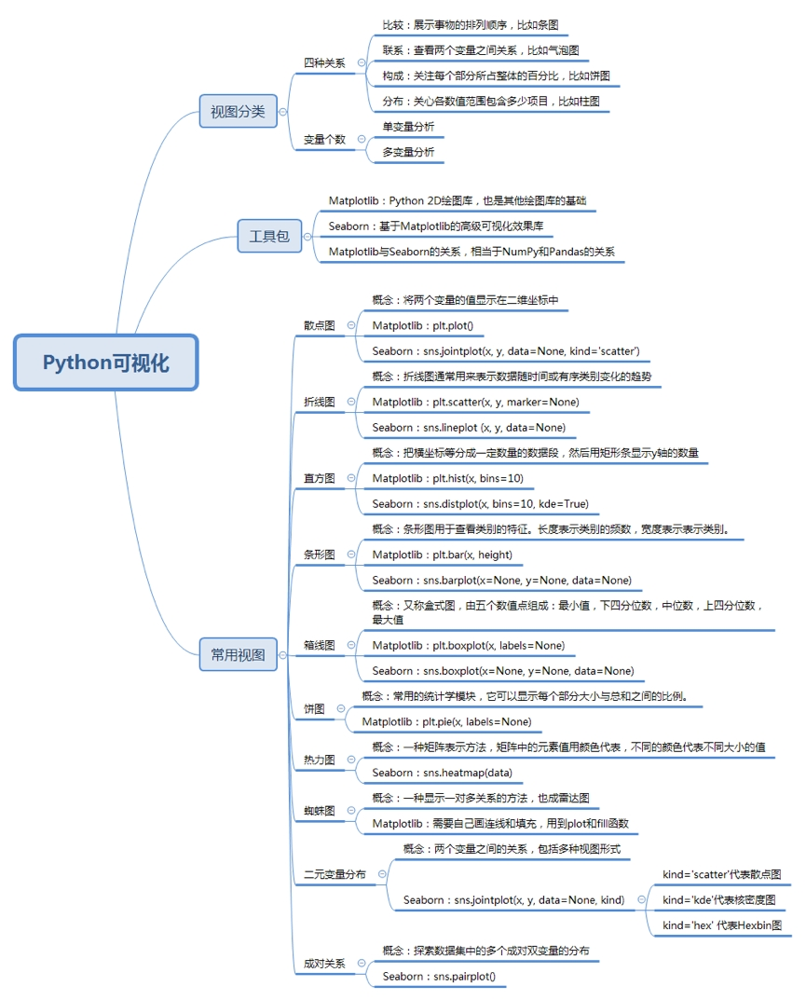

## 一次学会Python数据可视化的10种技能

## 1. 散点图

1、使用局部点渲染 散点图

[代码](./ScatterPlot.py)

## 2、使用随机点生成散点图
用于展现两个变量直接的关系

[代码](./useseaborn.py)

## 3. 折线图
用于表示数据随时间变化的趋势，  
如果横坐标是另一个变量，那这个变量应该先递增排序

[代码](./lineChart.py)

## 4.  直方图
用于表示变量的数值分布

[代码](./histogram.py)

## 5. 条形图
用于查看类别的特征

[代码](./diagram.py)

## 6. 箱线图
用于分析数据的差异性、离散程度和异常值

[代码](./boxPlot.py)

## 7.  饼图
用于展现每部分大小与总和之间的比例

[代码](./pie.py)

## 8.  热力图
热力图是一种矩阵表示方法，其中矩阵中的元素值用颜色表示

[代码](./aerogram.py)

## 9. 蜘蛛图
展示一个变量相对于另一个变量的显著性

[代码](./spider.py)

## 10.二元变量分布
看两个变量之间的关系
[代码](./twovar.py)

## 11.成对关系
多个成对双变量的分布
[代码](./pair.py)

[作业](./practice.py)