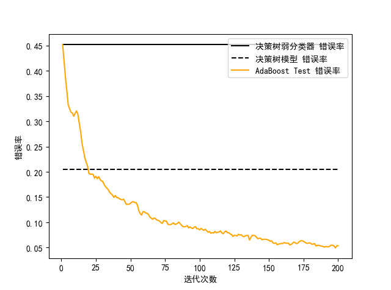

## 分类 和 回归

- 本质：对事物做预测
- 不同： 输出的结果类型
  - 分类
    - 离散值
  - 回归
    - 连续值
 
 ## 1. 使用 `AdaBoost` 工具
 
 ```python
from sklearn.ensemble import AdaBoostClassifier#分类预测用
AdaBoostClassifier(base_estimator=None,n_estimators=50,learning_rate=1.0,algorithm='SAMME.R',random_state=None)
```
- base_estimator：代表的是弱分类器，默认使用的是决策树。
- n_estimators：算法的最大迭代次数，也就是分类器的个数，每一次迭代都会引入一个新的弱分类器来增加原有的分类器的组合能力。
- learning_rate：代表学习率，取值在0-1之间，默认是1。如果学习率较小，就需要比较多的迭代次数才能收敛，也就是说学习率和迭代次数是有相关性的。当你调整learning_rate的时候，往往也需要调整n_estimators这个参数
- algorithm：采用哪种boosting算法，SAMME还是SAMME.R，它们对弱分类权重的计算方式不同。
- random_state：随机种子的设置。如果不设置随机种子，每次得到的随机数也就不同。


 ```python
from sklearn.ensemble import AdaBoostRegressor#回归预测用
AdaBoostingRegressor(base_estimator=None,n_estimators=50,learning_rate=1.0,loss='linear',random_state=None)
```
- loss：损失函数的设置，一共有3中选择，分别为linear、square和exponential，它们的含义分别是线性、平方和指数。

## 放假预测

我们看下 `sklearn` 中自带的波士顿房价数据集。

13项指标


## 运算过程

1. 加载数据

2. 分隔数据为训练集和测试集

3. 创建 `AdaBoost` 回归模型

4. 传入训练集数据进行拟合

5. 传入测试数据集进行预测


### 代码

  [示例代码](demo1.py)
  
## 使用决策树和回归树

   [示例代码](demo2.py)
   
## AdaBoost 与决策树模型的比较
在sklearn中AdaBoost默认采用的是决策树模型，现对比AdaBoost中的弱分类器（也就是决策树弱分类器）、决策树分类器和AdaBoost模型在分类准确率上的表现

   [官方代码](demo3.py)
   
   从图中可以看到，弱分类器的错误率最高，只比随机分类结果略好，准确率稍微大于50%。决策树模型的错误率明显要低很多。而AdaBoost模型在迭代次数超过25次之后，错误率有了明显下降，经过125次之后错误率的变化趋于平缓。  
   所有AdaBoost的优势在于框架本身，它通过一种迭代机制将原本性能不强的分类器组合起来，形成一个强分类器。
   [pipenv 代码-没有跑](demo3-1.py)
   
## 总结


   