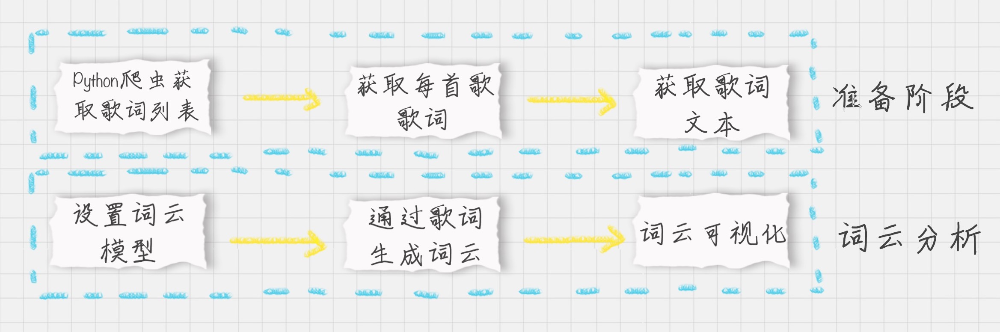
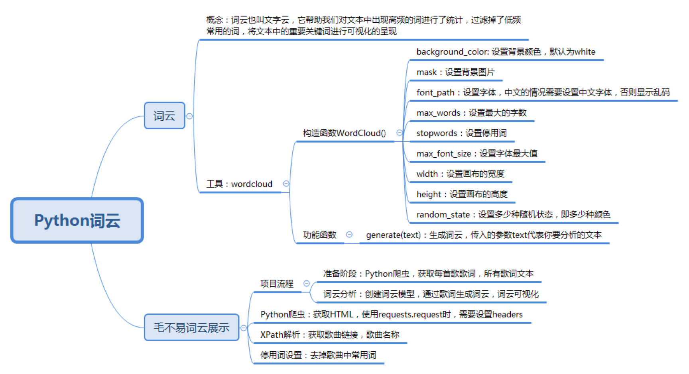

## 如何给毛不易的歌曲做词云展示

### 目标

1. 掌握词云分析工具
2. 掌握Python爬虫
3. 掌握Xpath工具

## 词云

词云 == 文字云

目的： 统计文本中高频出现的词 去掉重复常用词 将重要关键词进行可视化，方便文本分析者更快更好的了解文本的重点，同时具有美观度

## 工具

名称: `WordCloud`

安装： `pip install wordcloud`

[构造函数代码](./constructor.py) 
```python
wc = WordCloud(
  background_color='white',  # 设置背景颜色
  mask=backgroud_Image,  # 设置背景图片
  font_path='./SimHei.ttf',  # 设置字体，针对中文的情况需要设置中文字体，否则显示乱码
  max_words=100,  # 设置最大的字数
  stopwords=STOPWORDS,  # 设置停用词
  max_font_size=150,  # 设置字体最大值
  width=2000,  # 设置画布的宽度
  height=1200,  # 设置画布的高度
  random_state=30  # 设置多少种随机状态，即多少种颜色
)
```
生成词云的方式

```python
# text 代表要分析的文本
wordcloud.generate(text)
```

保存图片的方式

```python
wordcloud.tofile('a.jpg')
```

可视化方式

[可视化代码](./demo1.py)
```python
import matplotlib.pyplot as plt
plt.imshow(wordcloud)
plt.axis("off")#不显示坐标轴
plt.show()
```

完整案例 

专栏前 15 节的标题进行词云可视化

[完整实例](demo2.py)

去掉停用词

[实例代码](demo3.py)


## 给毛不易的歌词制作词云

1 具体步骤



2. [实例代码-只看这个即可](demo4.py)
[练习代码](practice.py)

## 总结




