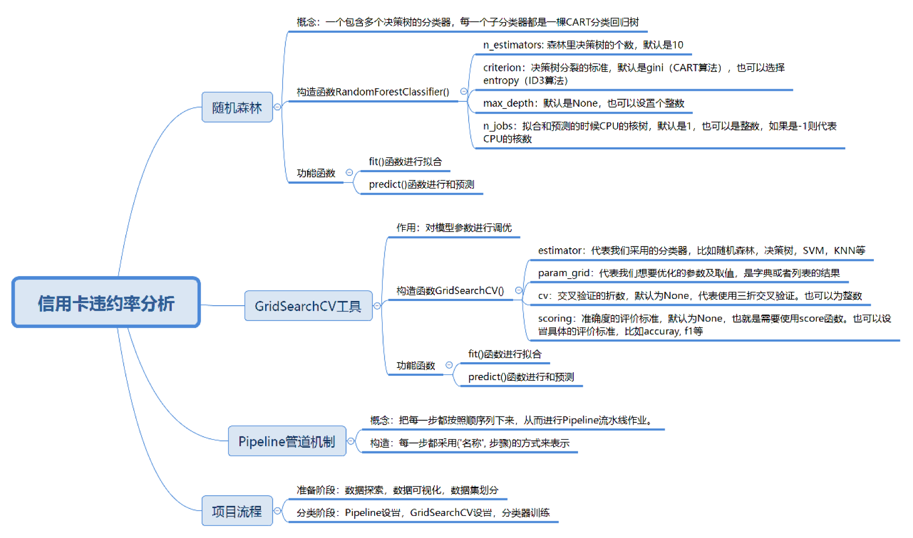

## 39讲

- 如何选择分类器：SVM，决策树，KNN
- 如何优化分类器的参数，以便得到更好的分类准确率
- 数据探索和数据可视化
- 对数据的完整性和质量做评估

## 随机森林算法 `demo`
随机森林实际上是一个包含多个决策树的分类器，每一个子分类器都是一棵CART分类回归树。所以随机森林既可以做分类，也可以做回归。当它做分类的时候，输出结果是每个子分类器的分类结果中最多的那个。当它做回归的时候，输出结果是每棵CART树的回归结果的平均值。

[代码实例](demo.py)

## `Pipeline` 管道机制流水线作业

分类步骤

 1. 数据规范化处理
   - `StandardScaler()` 方法
 2. `PCA` 方法 对数据降维

 3. 分类器分类
 
 
 [代码实例](demo2.py)
 
 采用 Pipeline 管道机制，先用StandardScaler方法对 IRIS 数据规范化，然后再用随机森林对数据集做一下分类
- (名称，步骤)  

 [代码](demo3.py)

## 对信用卡违约率进行分析

数据集字段

构建分类器

  1. 加载数据
  2.  准备阶段
      - train_test_split 划分数据集
  3. 分类阶段
     - 管道机制
     - 数据规范
     - 分类
 
实战

 [官方代码-没有跑](./credit_default/credit_default_analysis.py)
 
 [demo4](demo4.py)
 [作业](practice.py)
 ## 总结
 
 
 