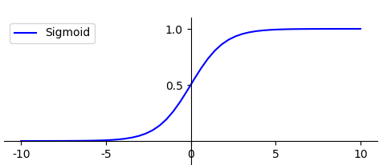
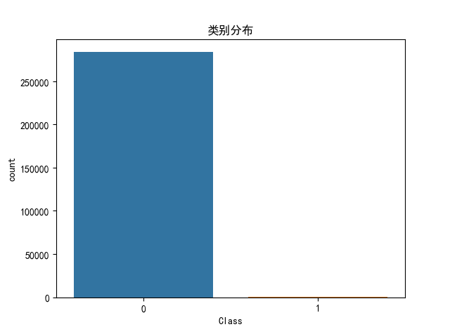
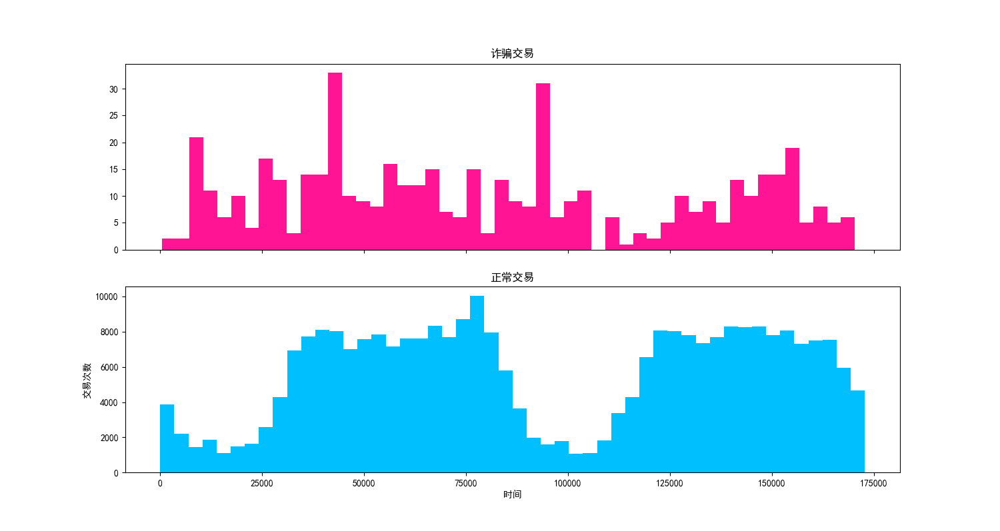
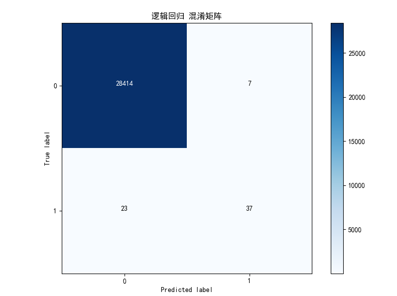
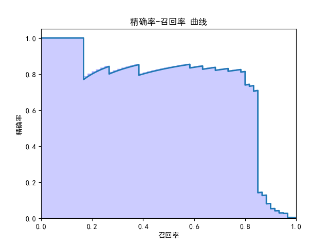

## 信用卡诈骗分析

问题

 1. 比例更小
 2. 危害更大

## 掌握

1. 逻辑回归分类
2. 二分类问题，什么模型评估更准确
3. 实战项目

## 构建逻辑回归分类器

1. 概念

逻辑回归

`logistic` 回归，它实际上是分类方法，为了解决二分类问题。也可解决多分类问题  
在逻辑回归中使用了Logistic函数，也称为Sigmoid函数  

2. 函数公式  

$$g(z)=\frac{1}{1+e^{-z}}$$


函数图形



- g(z)的结果在0-1之间。`z` 越大的时候，`g(z)` 越大，当 `z` 趋近于无穷大的时候，`g(z)` 趋近于 `1`

- `z` 趋近于无穷小的时候，`g(z)` 趋近于 0

- 函数值以 `0.5` 为中心

- `0` 即为不发生，`1` 即为发生

## 代码实现 `sklearn`
```
LogisticRegression()
```
参数：

- `penalty`：惩罚项，取值为 l1 或 l2，默认为 l2。当模型参数满足高斯分布的时候，使用l2，当模型参数满足拉普拉斯分布的时候，使用l1。
- `solver`：代表的是逻辑回归损失函数的优化方法。有5个参数可选，分别为liblinear,lbfgs,newton-cg,sag和saga。默认为liblinear，适用于数据量小的数据集，当数据量大的时候可以选用sga或saga方法。
- `max_iter`：算法收敛的最大迭代次数，默认为10.
- `n_jobs`：拟合和预测的时候 CPU 的核数，默认是 1

## 模型评估指标  
1. TP：预测为正，判断正确
2. FP：预测为正，判断错误
3. TN：预测为负，判断正确
4. FN：预测为负，判断错误

- 准确率：
$$Accuracy=\frac{TP+TN}{TP+TN+FP+FN}$$
准确率是正确分类的样本个数与总样本个数的比例，但当分类结果严重不平衡的时候，使用准确率很难反映模型的好坏

- 精确率：(被判断为1的样本中真正为1的比例)
$$P=\frac{TP}{TP+FP}$$
- 召回率：(真正为1的样本中被判断为1的比例)
$$R=\frac{TP}{TP+FN}$$

- F1 作为精确率 P 和召回率 R 的调和平均，数值越大代表模型的结果越好（当分类结果严重不平衡的时候，F1更适合用于评估模型的好坏）
$$F1=2*\frac{P*R}{P+R}$$


## 分析步骤

交易时间Time（其实只是序号），PCA降维后特征变量V1-28，Class=0正常，Class=1欺诈

[代码](credit_fraud_analysis.py)  
[练习](credit_fraud_svc.py)

总量



诈骗交易 && 正常交易



```
总交易笔数:  284807
诈骗交易笔数： 492
诈骗交易比例：0.001727
```

 逻辑回归 混淆矩阵



 精准率 召回率



## 说明

混淆矩阵

混淆矩阵也叫误差矩阵，实际上它就是 TP、FP、TN、FN 这四个数值的矩阵表示


`precision_recall_curve` 函数，预测值和真实值来计算精确率 - 召回率曲线

`precision_recall_curve` 函数会计算在不同概率阈值情况下的精确率和召回率


## 总结


