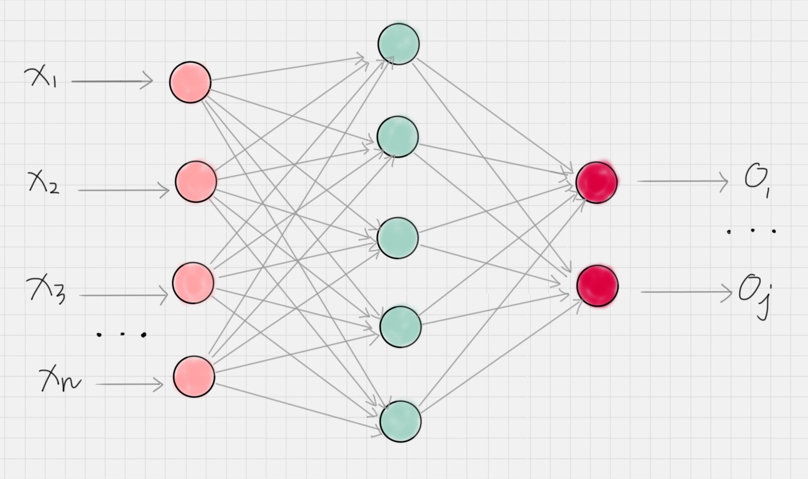
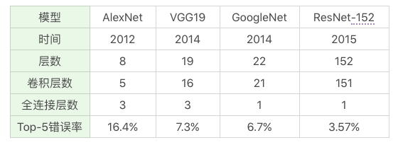
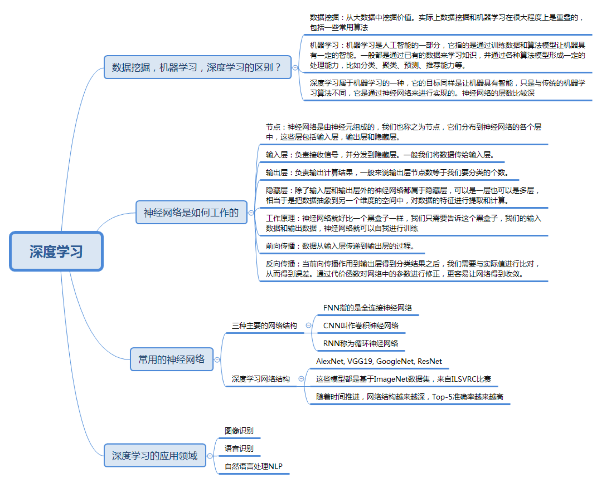

# 42丨当我们谈深度学习的时候，我们都在谈什么？

引入：

机器学习算法和深度学习有什么关联呢

了解深度学习

1. 数据挖掘 机器学习 深度学习的区别？ 概念？
2. 深度学习的大脑是如何工作的？
3. 深度学习是基于神经网络构建的，都有哪些常用的网络模型？
4. 深度学习三个重要领域  分别为？

## 区别

数据挖掘和机器学习在很大程度上是重叠的，如

- K-Means、
- KNN、
- SVM、
- 决策树、
- 朴素贝叶斯

到底他们的区别是？

1. 数据挖掘

> 从现有数据中提取规律模式（pattern）以及使用算法模型（model)。核心目的是找到这些数据变量之间的关系，因此我们也会通过数据可视化对变量之间的关系进行呈现，用算法模型挖掘变量之间的关联关系。通常情况下，我们只能判断出来变量A和变量B之间是有关系的，但并不一定清楚这两者之间有什么具体关系。在我们谈论数据挖掘的时候，更强调的是从数据中挖掘价值。

2. 机器学习是人工智能的一部分

> 它指的是通过训练数据和算法模型让机器具有一定的智能。一般是通过已有的数据来学习知识，并通过各种算法模型形成一定的处理能力，比如分类、聚类、预测、推荐能力等。这样当有新的数据进来时，就可以通过机器的智能帮我们完成某些特定的任务

3. 深度学习属于机器学习的一种

> 它的目标同样是让机器具有智能，但它是通过神经网络来实现的。（算法模型就是神经网络）神经网络好比是机器的大脑，一开始是一张白纸，多次训练之后，大脑逐渐具备某种能力。这个训练过程中，我们只需要告诉这个大脑输入数据是什么，以及对应的输出结果是什么即可。通过多次训练，“大脑”中的多层神经网络的参数就会自动优化，从而得到一个适应于训练数据的模型。

4. 深度学习与传统机器学习最大的区别

> **深度学习会自己找到数据的特征规律！而传统机器学习往往需要专家（我们）来告诉机器采用什么样的模型算法。**在深度学习，我们更关注的是网络结构，以及网络结构中每层神经元的传输机制。我们不需要告诉机器具体的特征规律是什么，只需把我们想要训练的数据和对应的结果告诉机器大脑即可。

## 神经网络如何工作
深度学习的神经网络结构通常比较深，一般都是5层以上，甚至也有101层或更多的层数。这些深度的神经网络可以让机器更好地自动捕获数据的特征。

### 概念

1. 节点

神经网络是由神经元组成的，也称之为节点。它们分布在神经网络的各个层中，包括输入层、输出层和隐藏层

2. 输入层

负责接收信号，并分发到隐藏层。一般我们将数据传给输入层

3. 输出层

负责输出计算结果，一般来说输出层节点数等于我们要分类的个数

4. 隐藏层

除了输入层和输出层外的神经网络都属于隐藏层，隐藏层可以是一层也可以是多层，每个隐藏层都会把前一层节点输出来的数据进行计算（你可以理解为某种抽象表示），这相当于把数据抽象到另一个维度的空间，可以更好地提取计算数据的特征。

### 原理

1. 黑盒子。神经网络就好比一个黑盒子。

2. 我们提供
  - 输入数据
  - 输出数据
3. 自我训练。神经网络就可以自我训练，在训练过程中，神经网络主要是通过通过前向传播和反向传播机制运作
4. 一旦训练好了，就可以像黑盒子一样使用，当你传入一个新的数据时，它就会告诉你对应的输出结果。

## 前向传播 和 反向传播

1. 前向传播

  - 数据从输入层传递到输出层的过程叫做前向传播。这个过程的计算结果通常是通过上一层的神经元的输出经过矩阵运算和激活函数得到的。这样就完成了每层之间的神经元数据的传递。

2. 反向传播
  - 当前向传播作用到输出层得到分类结果之后，我们需要和实际值进行比对，从而得到误差。

  - 反向传播也叫作误差反向传播，核心原理是通过代价函数对网络中的参数进行修正，这样更容易让网络参数得到收敛。

3. 整个神经网络训练过程是通过前向 - 反向传播迭代完成

  - 当达到指定的迭代次数或者达到收敛标准的时候即可停止训练，

  - 然后就可以拿训练好的网络模型对新的数据进行预测。

## 常用的神经网络

> 根据中间层功能的不同，神经网络可分为三种网络结构：`FNN`、`CNN` 和 `RNN`

 `FNN`  - 全连接神经网络(Fully-connected Neural NetWork)

每一层的神经元与上一层的所有神经元都是连接的。全连接的参数会过多，导致计算量过大，因此在实际使用中全连接神经网络的层数一般比较少。

 `CNN` - 卷积神经网络，图像处理中有广泛的应用。CNN网络中，包括了卷积层、池化层和全连接层。
  - 卷积层
    - 把图像进行分块，对每一块的图像进行变换操作
  - 池化层
    - 对神经元的数据进行降维处理，这样输出的维数就会减少很多，从而降低整体的计算量
  - 全连接层
    - 全连接层通常是输出层的上一层，它将上一层神经元输出的数据转变成一维的向量

`RNN` - 循环神经网络
  - 神经元的输出可以在下一个时刻作用到自身
  - 这样RNN可以看做是在时间上传递的神经网络
  - 应用场景:语音识别、自然语言处理等于上下文相关的场景。

深度学习网络往往包括了这三种网络的变种形成，常用的深度神经网络包括：  
 `AlexNet`、`VGG19`、`GoogleNet`、`ResNet`等，它们的特点是：

深度学习领域

- 图像识别（图像分类、物件检测）
- 语音识别
- 自然语言处理（自动问答、智能客服、过滤垃圾邮件和短信）

## 总结
深度学习的普适性更强，但需要大量的数据和学习时间

## 引用内容版权声明
极客时间版权所有: https://time.geekbang.org/column/

Copyright (c) 2019 Copyright Holder All Rights Reserved.
