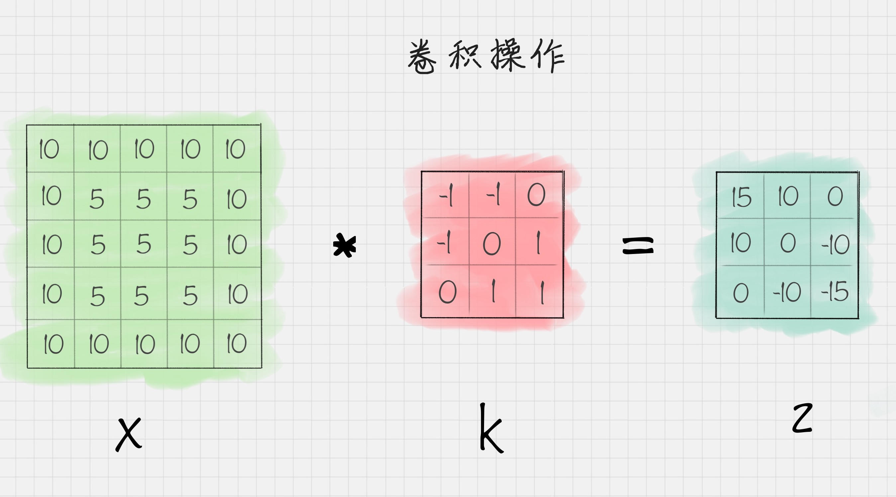
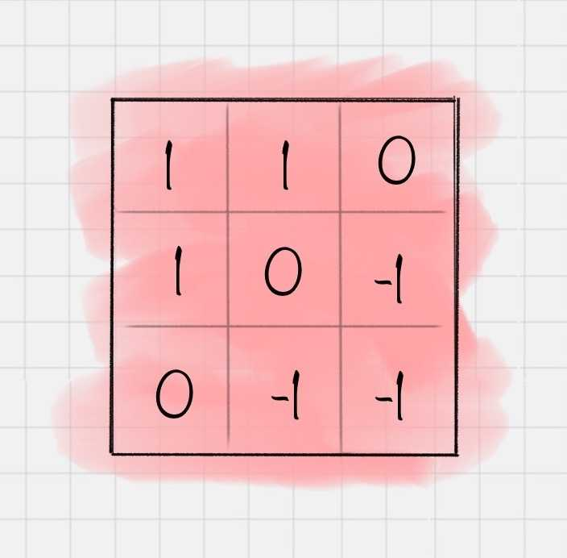
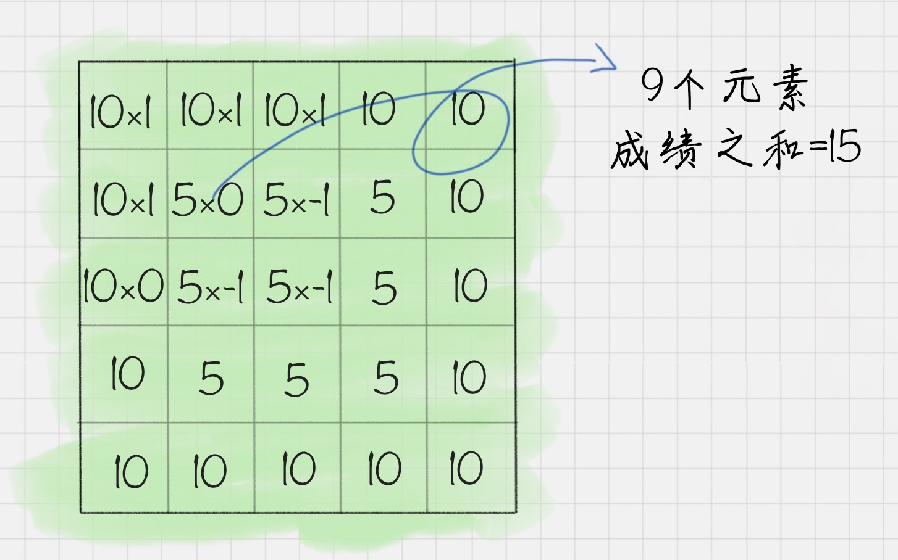
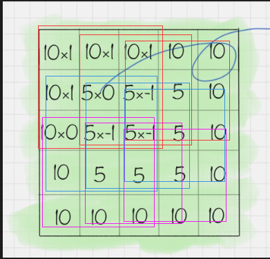
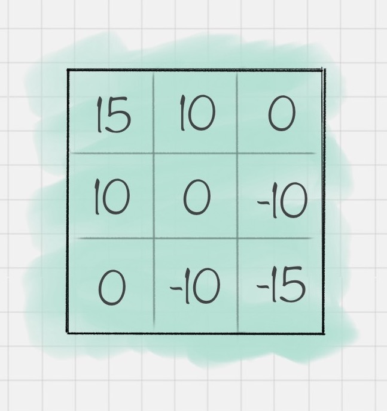

43丨深度学习（下）：如何用Keras搭建深度学习网络做手写数字识别？

## 理解卷积的作用
### CNN 网络结构

* 卷积层: 把图像分块，对每一块的图像进行卷积操作
* 池化层
* 全连接层

### 什么是卷积？

假设有一张二维图像X，和卷积K，二维矩阵X进行卷积K操作之后，得到矩阵Z



1. 翻转矩阵180度

> 至于为什么，客官请看社区的这篇文章: [链接1][]

2. 卷积运算



3. 重复第二步骤 得到结果



使用代码进行总结

[点我](demo.py)

4. 图像卷积

[代码](demo1.py)

效果：


实际上每个卷积都是一种滤波器,筛选图像中符合条件的部分,类似特征提取

卷积层可以有多个卷积核，例如LeNet,它的第一层含有6个，可以提取图像的6个特征，从而得到6个特征图（feature maps)

## 特征函数的作用

卷积操作的下一步，需要用激活函数做进一步处理。 `Sigmoid`、`tanh`、`ReLU` 都是常用的激活函数。这些激活函数通常都是非线性的函数，使用它们的目的是把线性数值映射到非线性空间中。  

卷积操作实际上是两个矩阵之间的乘法，得到的结果也是线性的。只有通过非线性的激活函数运算之后，才能映射到非线性空间中，这样可以让神经网络的表达能力更强大。


## 池化层的作用

- 位置： 通常位于两个卷积层之间
- 作用： 对神经元的数据做降维处理
- 目的： 降低整体计算量。假设池化的窗口大小是2x2，就相当于用一个2x2的窗口对数据进行计算，将原图中是2x2矩阵的4个点变成1个点
- 常用的池化操作：
  - 平均池化：对特征点求平均值，也就是用4个点的平均值来做代表
  - 最大池化：对特征点求最大值，也就是用4个点的最大值来做代表


## 全连接层的作用

全连接层将前面一层的输出结果与当前层的每个神经元都进行了连接，这样可以把前面计算出来的所有特征，通过全连接层将输出值输送给分类器

比如 `Softmax` 分类器。在深度学习中，`Softmax`比较实用，通过它可以把输入值映射到0-1之间，（可以理解为每个输出结果的概率值），而且所有输出结果相加等于1。

## CNN网络结构
CNN网络结构：
- 通过卷积层提取特征，
- 通过激活函数让结果映射到非线性空间，增强了结果的表达能力，
- 再通过池化层压缩特征图，降低了网络复杂度，
- 最后通过全连接层归一化，
- 然后连接Softmax分类器进行计算每个类别的概率。

## `LeNet` 和 `AlexNet` 网络

通常我们可以使用多个卷积层和池化层，最后再连接一个或者多个全连接层...
LeNet 提出于 1986 年，是最早用于数字识别的 CNN网络...

AlexNet 在 LeNet 的基础上做了改进，提出了更深的CNN网络...

后面提出的深度模型，比如VGG、GoogleNet和ResNet

网络结构|输入尺寸|卷积层|池化层|全连接层|输出类别数
--|--|--|---|---|---|---|
LeNet|32*32|3|2|2|10
AlexNet|227\*227\*3|5|3|3|1000


## 常用的深度学习框架对比


## 用 `Keras` 做 `Mnist` 手写数字识别
使用 `Keras` 之前，我们需要安装相应的工具包-till here
```
pip install keras
pip install tensorflow
pip install -U numpy
```
`Keras` 需要用 `tensorflow` 或者 `theano` 作为后端，而且需要采用最新的Numpy版本才能运行keras

### 创建蓄贯模型
创建一个Sequential序贯模型，它的作用是可以将多个网络层线性堆叠起来
```python
from keras.models import Sequential
model = Sequential()
```
### 创建二维卷积层

使用 `Conv2D(filters, kernel_size,activation=None)` 进行创建，其中

- `filters` 代表卷积核的数量
- `kernel_size` 代表卷积核的宽度和长度
- `activation` 代表激活函数

如果创建的二维卷积层是第一个卷积层，我们还需要提供 `input_shape` 参数，比如input_shape=(28,28,1)代表的就是28*28的灰度图像

### 对 `2D` 信号做最大池化层

使用`MaxPooling2D(pool_size=(2, 2))`进行创建，其中`pool_size` 代表下采样因子，比如pool_size=(2,2)相当于将原来2*2的矩阵变成1个点，即用2\*2矩阵中的最大值代替，输出的图像在长度和宽度上均为原图的一半。

### 创建 Flatten 层

使用 `Flatten()` 创建

### 创建全连接层

使用 Dense(units, activation=Non...

model.compile(loss, optimizer=‘adam’, metrics=[‘accuracy’]) 来完成损失函数和优化器的

### 示例代码

 [点我](demo3.py)

## 总结


[链接1]: https://cloud.tencent.com/developer/article/1366358 "什么！卷积要旋转180度？！"
